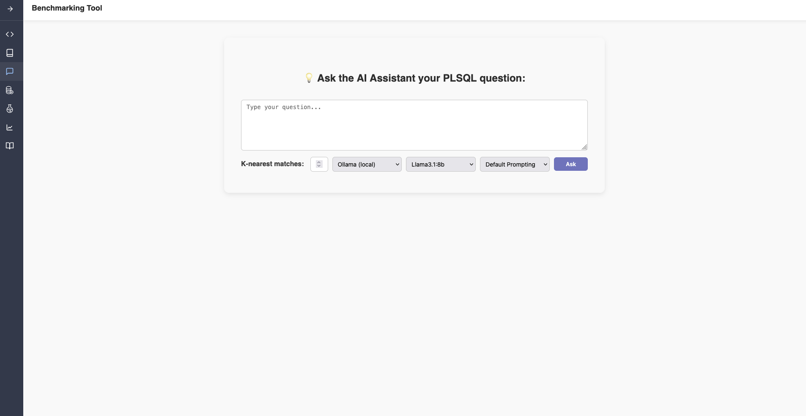
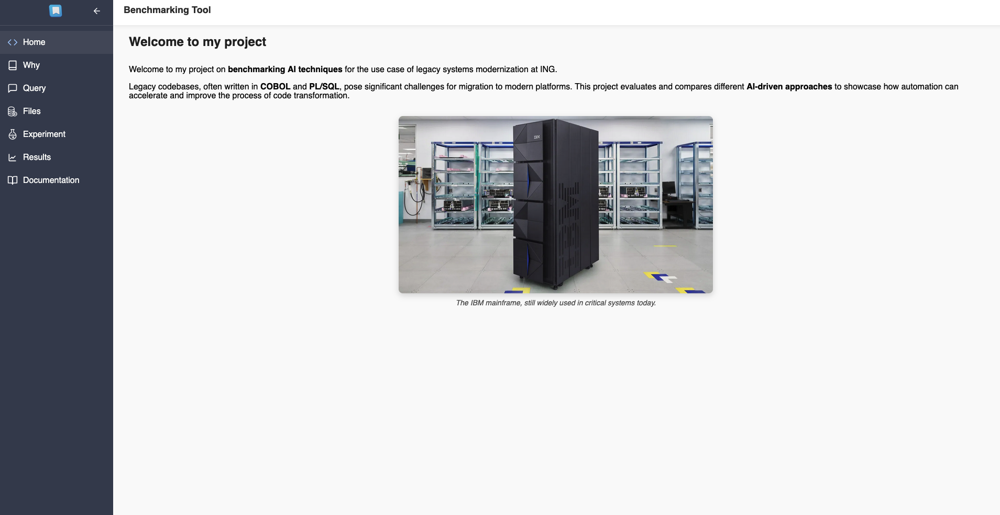
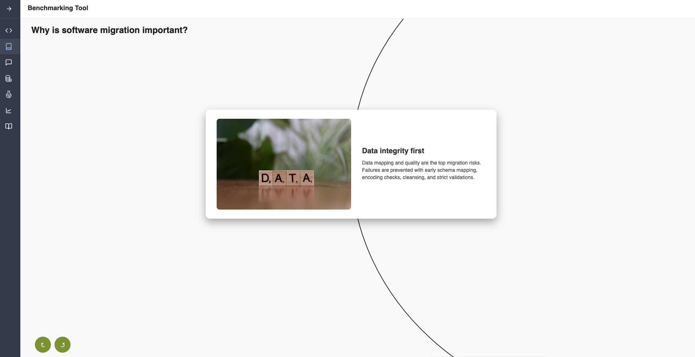
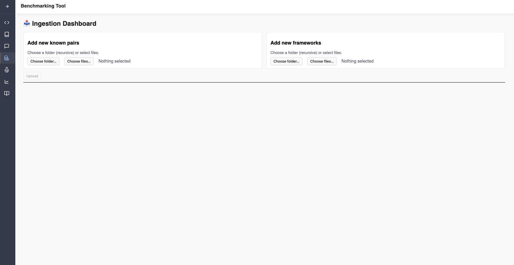
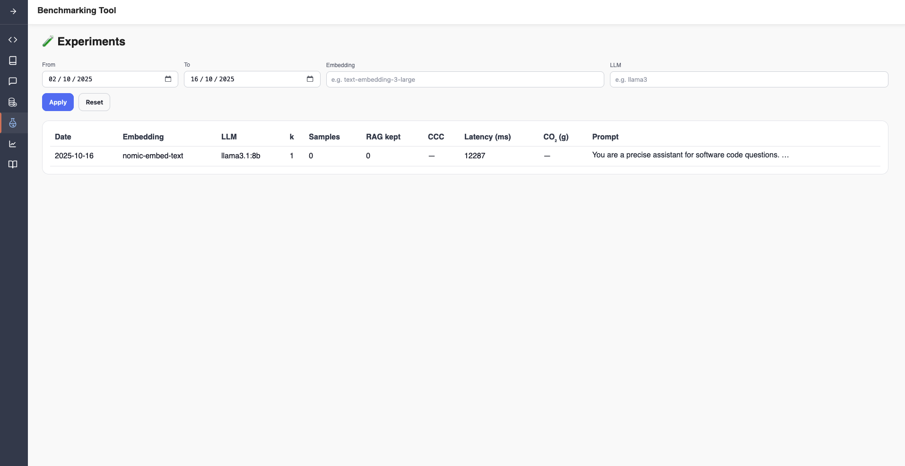

## About The Project



This tool aims to make it easier to benchmark different code translation AI techniques. It compares different approaches:
* Prompt engineering
* Code Chunking
* Different LLMs
* LLMs costs

Due to the AI field's rapid evolution, a hexagonal architecture was used, which aims to make it easier to plug more techniques, as well as overall maintainability.

## Why this exists

See which LLM/provider/model gives the best translation quality for your codebase.

Understand trade-offs (speed, quality, cost).

Keep experiments reproducible by keeping track of your previous tracks.


### Built With

* [](https://angular.io)
* [](https://spring.io/projects/spring-boot)
* [](https://www.docker.com/)
* [](https://nginx.org/)
* [](https://weaviate.io/)
* [](https://ollama.com/)


## Screenshots








## Getting Started

### Prerequisites

* Docker & Docker Compose


```sh
docker --version
docker compose version
```

* Clone

```sh
git clone https://github.com/andratr/bmtool1
cd bmtool1
```

* Configure evironment variables

The secrets/ folder holds secret files that are ignored by git. You commit only the *.example templates—never the real values.

Steps to create your secret files from the template:

1. Copy each *.example file to the same name without .example

2. Put your real values in the non-.example files

3. Never commit real values (already prevented by .gitignore)

Tip: Get an OpenRouter API key at https://openrouter.ai/
```sh
# 1) secrets: duplicate templates → real files
mkdir -p secrets
cp secrets/openrouter_api_key.example           secrets/openrouter_api_key
cp secrets/postgres_password.example            secrets/postgres_password
cp secrets/spring.datasource.username.example   secrets/spring.datasource.username
cp secrets/spring.datasource.password.example   secrets/spring.datasource.password

# 2) fill in your real values (examples)
# OpenRouter
echo "sk-or-REPLACE_WITH_YOUR_KEY" > secrets/openrouter_api_key

# Postgres / Spring (must match each other)
echo "your-db-username"     > secrets/spring.datasource.username
echo "your-password"        > secrets/spring.datasource.password
echo "your-password"        > secrets/postgres_password

# 3) check 
ls -1 secrets
test -s secrets/openrouter_api_key && echo "OpenRouter key set" || echo "OpenRouter key missing"

```


## Runbook (Dev and Prod)

### Dev profile (which has hot reload)

Start:

```sh

docker compose --profile dev up -d --build   
```

Logs:

```sh
docker compose --profile dev logs -f backend-dev frontend-dev
```


### Prod profile (Nginx + jar)

Start:

```sh
# stop dev, if running
docker compose --profile dev down

# start prod
docker compose --profile prod up -d --build backend frontend
```

Restart all services:

```sh
docker compose --profile dev down             
docker compose --profile dev up -d 
```

Restart a single service:

```sh
docker compose --profile prod up -d --build frontend 
docker compose --profile prod up -d --build backend   
```


# Other useful commands


Reset RAG Weaviate database entries:

```sh
curl -sS -X DELETE "http://localhost:8090/v1/schema/PairChunk" | jq .

curl -sS -X DELETE "http://localhost:8090/v1/schema/FrameworkSnippet" | jq .
```


## Contributing

1. Fork the Project
2. Create a Feature Branch (`git checkout -b feature/AmazingFeature`)
3. Commit your Changes (`git commit -m 'Add some AmazingFeature'`)
4. Push (`git push origin feature/AmazingFeature`)
5. Open a PR

## Contact

Andra Trandafir - [andratrandafir@yahoo.com](mailto:andratrandafir@yahoo.com)


## Acknowledgments

* []()
* []()
* []()


